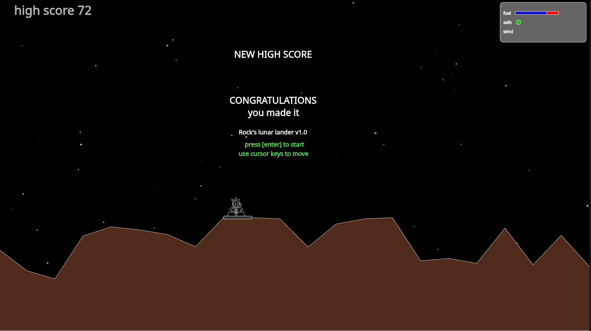
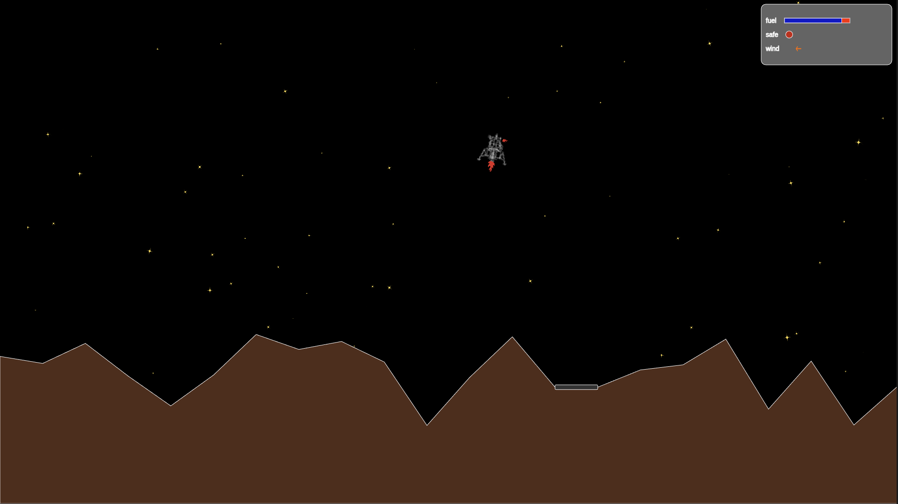
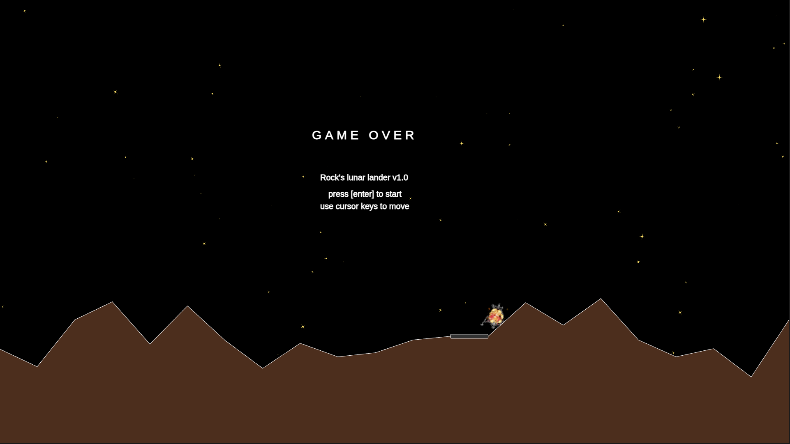

## Rock's Lunar Lander
A game written by Rock using `p5.js` in 1080p (canvas size 1920 x 1080).

keys: cursor keys for thrust and left and right
[enter] to start
[esc] to quit

WARNING: keys capture doesn't seem to work well on FireFox, please try Chromium or Chrome.

